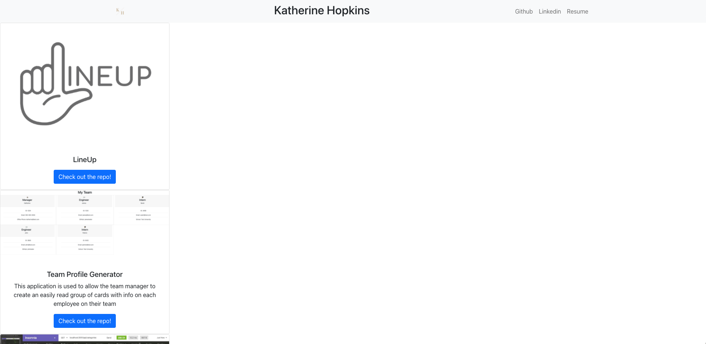

# Unit 20 React Homework: React Portfolio

# Badge: 

# Table of Contents

1. [Description](#description)
2. [Technologies Used](#technologies-used)
3. [Installation](#installation)
4. [Usage](#usage)
5. [Contributions](#contribution)
6. [License](#license)
7. [Testing Instructions](#testing-instructions)
8. [Questions](#questions)

# Description

This React app is to highlight my best works during my Bootcamp.

# Technologies Used

HTML
CSS
JavaScript
React
Bootstrap
React Icons

# Installation

NPM install
NPM install
NPM install

# Usage

My React Portfolio 

# Contributions

None

# License

This project is licensed under MIT

# Testing Instructions

# Questions

1. My Github Profile: https://github.com/kjackson206
2. This Project: https://khopkins206.github.io/react-portfolio/
3. My Email: katherine.jackson206@gmail.com
